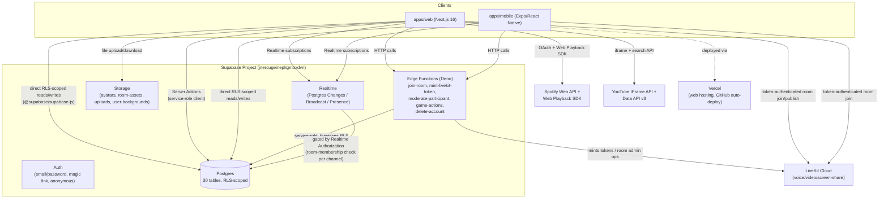

# ARCHITECTURE.md — Technical Architecture Reference

## System overview

Yume is a Supabase-backed monorepo with two clients (Next.js web, Expo/React Native iOS) sharing one Postgres database, one set of Edge Functions, and one LiveKit Cloud project. There is **no traditional backend API server** — most data access is direct client-to-Postgres via Supabase's PostgREST layer, authorized entirely by Row Level Security. The exceptions (things that need privileges RLS can't express, or that touch a third-party system like LiveKit) go through either Next.js Server Actions (web-only, using a service-role Supabase client) or Supabase Edge Functions (callable from both clients).

---

## Frontend architecture — web (`apps/web`)

- **Framework:** Next.js 16 App Router, Turbopack, React 19.
- **Rendering strategy:** Server Components by default for data-loading pages (`page.tsx` files fetch data server-side via the SSR Supabase client, pass plain data down as props). Client Components (`"use client"`) for anything interactive — the room canvas, chat panel, every dialog, the camera-effects pipeline.
- **Routing:** File-based App Router. Route groups: `(auth)` wraps sign-in/sign-up/reset-password with a shared layout; everything else is flat (`/rooms`, `/room/[roomId]`, `/settings`, `/invite/[token]`, `/privacy`, `/terms`, `/changelog`).
- **Server/client boundary:** Enforced by file convention (`"use client"` directive) plus a hard rule already proven in this codebase: **Server Action arguments/return values must be plain serializable data.** When a Server Action needed to accept an object with function properties (a `GameEngine`), the fix was to split it into a non-Server-Action `import "server-only"` file (`game-dispatch.ts`) called server-to-server by thin, fully-serializable-args Server Action wrappers per game. This pattern should be reused for any similar future case.
- **State management:** No global state library (no Redux/Zustand/Jotai). State is local `useState`/`useReducer` per component, synced to Postgres via Realtime subscriptions where multi-user consistency is needed. Each feature has its own `use-<feature>.ts` hook that owns both the Realtime subscription and the mutation functions (e.g. `use-room-chat.ts`, `use-youtube-session.ts`, `use-drawing-layer.ts`).
- **Middleware:** `apps/web/src/proxy.ts` (Next 16 renamed `middleware.ts`) — refreshes the Supabase session cookie on every non-static request. It does **not** do route protection; that's per-page via `requireUser()`/`requireProfile()`.

## Frontend architecture — mobile (`apps/mobile`)

- **Framework:** Expo (managed workflow, dev-client build — not Expo Go, because native modules like LiveKit and react-native-skia require prebuild), React Native 0.86.
- **Navigation:** **No navigation library.** `App.tsx` hand-rolls screen switching via `useState<string | null>` (which room is open, whether Settings is open) — a deliberate choice documented in-code, revisited if the screen count grows. There is no deep-linking, no back-stack.
- **Data access:** Every mobile screen/component talks **directly** to Supabase (no server layer at all on mobile) — either RLS-scoped client calls (`apps/mobile/src/lib/supabase.ts`) or the same Edge Functions the web app calls, over plain `fetch()` (see `apps/mobile/src/lib/*.ts` — `livekit-token.ts`, `moderation-actions.ts`, `game-actions.ts`).
- **Canvas:** `@shopify/react-native-skia`, deliberately thinner than the web Konva canvas (single-object drag, no multi-select/resize/rotate/drawing/notes) — documented as real-but-scoped-down, not a stub.

## Request lifecycle (example: loading a room)

1. Browser/app navigates to `/room/[roomId]` (web) or taps a room card (mobile).
2. **Web:** `apps/web/src/app/room/[roomId]/page.tsx` (Server Component) runs `requireProfile()`, then issues parallel Supabase queries (room, membership, objects, assets, templates) using the SSR client — all RLS-scoped as the signed-in user. If no membership row exists, redirect to `/rooms`.
3. Server-rendered HTML (room chrome, initial object list) is sent to the browser; `RoomStage` (Client Component) hydrates and takes over — opens Realtime subscriptions for presence, live object drags, chat, etc.
4. **Mobile:** `RoomDetailScreen` mounts, fires off `useEffect`-driven Supabase queries directly from the client for room name/role, then renders `RoomCanvasView`/`CallView`/etc., each owning its own Realtime subscription.

## Data flow (real-time sync)

Two tiers, matching `docs/phase-1/05-sync-protocol.md`'s original design (still accurate):

- **Tier 1 — Broadcast (ephemeral, never hits Postgres):** live cursor position during a drag, in-progress draw strokes. Low-latency, high-frequency, no persistence needed until the gesture ends.
- **Tier 2 — Postgres Changes (persisted, then broadcast on write):** everything else — chat messages, notes, timers, game state, YouTube/Spotify session state, finalized drawing strokes, decoration object positions after drag-end. A write to Postgres is the source of truth; Realtime just notifies other connected clients to re-fetch or apply the delta.
- **Presence:** who's currently in a room, their camera bubble position, speaking/muted/camera-on state — a separate Supabase Realtime Presence channel per room (`room:{roomId}:presence`), gated by Realtime Authorization (see below).

**Realtime Authorization:** every `room:{roomId}:*` channel is gated server-side by a check that the connecting user is actually a member of that room (`supabase/migrations/0004_realtime_authorization.sql`) — this is what stops someone from subscribing to a room's presence/broadcast channel without being a member, since Realtime channel subscriptions aren't otherwise covered by table-level RLS.

## Authentication flow

1. Sign-up/sign-in/magic-link/anonymous — all via `supabase.auth.*` methods called from `apps/web/src/app/(auth)/actions.ts` (web) or directly from components (mobile).
2. Supabase issues a JWT session (access + refresh token), stored in cookies (web, via `@supabase/ssr`) or `AsyncStorage` (mobile, via `@supabase/supabase-js`'s built-in storage adapter).
3. Every subsequent request carries this JWT; Postgres's `auth.uid()` (called inside RLS policies) resolves it via the `request.jwt.claims` GUC that PostgREST sets after verifying the JWT.
4. **First-login profile creation is lazy**, not automatic: `requireProfile()` (web) / `ensureProfile()` (mobile) / the `join-room` Edge Function each independently check-then-insert a `profiles` row on first use. This pattern exists in three places because the "insert a profile" need arises from three different entry points (visiting the app directly, mobile app open, clicking an invite link) — **this triplication is a known, accepted duplication**, not an oversight; see `DECISIONS.md`.

## Authorization flow

Almost entirely RLS. The `room_role(room_id, profile_id)` Postgres function (`security definer`, defined in `0002_rls.sql`) is the building block nearly every policy in the database is written against — it returns the caller's role in a given room (or `null` if not a member) and gets called inside `USING`/`WITH CHECK` clauses everywhere. A handful of operations (game move validation, moderation actions, invite-token validation) need privileges RLS can't express (server-side secret comparison, cross-system side effects, "trust the server's read of authoritative state, not what the client claims") — those go through a service-role client, always in a dedicated file/function with a comment explaining why RLS wasn't sufficient.

## Database access pattern

See `DATABASE.md` for the full schema. Pattern summary: direct client-to-Postgres via `@supabase/supabase-js`'s query builder (`.from(table).select/insert/update/delete()`), RLS-authorized. A handful of Postgres RPC functions (`restore_room_version`, `append_drawing_stroke`, `clear_drawing_layer`, `increment_game_score`, `check_rate_limit`) exist for operations that need atomicity a plain multi-statement client operation can't guarantee over PostgREST (no client-side transactions).

**Known sharp edge (found live, cost real debugging time):** Postgres RLS enforces the table's `SELECT` policy on any row an `INSERT ... RETURNING` tries to return — which `.insert(...).select().single()` (a very common pattern in this codebase) triggers via PostgREST's `Prefer: return=representation` header. If a row's SELECT-visibility depends on a *separate* row that a trigger creates as a side effect of the same INSERT (the `rooms` → `room_memberships` owner-row trigger is the exact case that broke), the RETURNING clause can fail RLS even though the INSERT's own `WITH CHECK` passed. The fix used was to widen the SELECT policy (owner can always see their own row) rather than remove the trigger or the RETURNING call — see `DECISIONS.md` for the full account. **Any new `.insert().select()` call against a table whose SELECT policy depends on a same-transaction trigger side effect should be checked against this exact failure mode.**

## Storage flow

Four Supabase Storage buckets: `avatars` (public, own-folder-scoped writes), `room-assets` (public, service-role-insert-only — decoration art), `uploads` (private, room-membership-scoped, signed URLs — chat images), `user-backgrounds` (public, own-folder-scoped writes — custom page backgrounds). All have server-side `file_size_limit`/`allowed_mime_types` enforcement (Supabase Storage's own enforcement, not just client-side validation) as of `0017_upload_restrictions.sql`. No malware/content scanning exists (documented, deliberate gap — no such API is configured).

## External integration flow

- **LiveKit:** tokens minted server-side only (`mint-livekit-token` Edge Function, uses `livekit-server-sdk`'s `AccessToken`), never client-generated. Screen share, camera, mic are all separate LiveKit track types published independently — no code-level conflict between them.
- **Spotify:** OAuth Authorization Code flow (`apps/web/src/app/spotify/connect|callback/route.ts`), token storage in `spotify_connections` (RLS: own-row only, never client-readable directly by other users), playback via the official Web Playback SDK running independently in each connected member's own browser — **there is no real shared "Jam"-style single audio stream**; each Premium member's browser becomes its own Spotify Connect device, all told to play the same track/position via the app's own `media_sessions`/`media_queue_items` sync layer. This is a real, documented, non-obvious product constraint, not a bug.
- **YouTube:** the official IFrame Player API for playback (no key required), YouTube Data API v3 for the in-app search box only (paste-a-URL works without any key).

## Background/scheduled processing

**None exists.** No cron jobs, no queues, no background workers. Everything is either synchronous request/response or driven by client-side Realtime subscriptions.

## Caching

Minimal. Next.js's default fetch/route caching applies where used; Turborepo caches build/typecheck/lint outputs locally (see `turbo.json`'s `env` list for cache-invalidation-relevant secrets). No application-level cache (no Redis, no in-memory cache layer).

## Error handling

- **Server Actions:** return `{ error?: string }` state objects, surfaced via `useActionState`/`useTransition` + `sonner` toasts. Not exceptions.
- **Direct client Supabase calls:** many hooks in this codebase (a real, documented gap) **do not check the `error` field of the Supabase response at all** — e.g. `use-youtube-session.ts`'s `addToQueue`/`ensureSession` silently do nothing on failure. This has already contributed to at least one hard-to-diagnose bug feeling like "it's just not working" with no visible error. New code following this pattern should add error surfacing; existing code following it should be treated as a known risk area, not fixed reflexively without a reason to touch that file.
- **Edge Functions:** return `{ error: string }` JSON bodies with appropriate HTTP status codes. One instance of a misleading generic error reason (`"invalid_token"` reused for an unrelated failure) was found and fixed in `join-room` — see `DECISIONS.md`.

## Logging

No structured logging, no log aggregation service. Debugging during development relied on Vercel's deployment logs (`vercel logs <url>`) and Supabase's Management API log-query endpoint (`analytics/endpoints/logs.all`) — both were used live during this project's bug-hunting and are the right tools for a future session to reach for.

## Deployment architecture

See `DEPLOYMENT.md` for full detail. Summary: Vercel (web, project `yume`, Root Directory `apps/web`, GitHub-connected auto-deploy on push to `main`) + Supabase (backend, manual `supabase db push`/`functions deploy`, not tied to the Vercel deploy pipeline) + no mobile deployment pipeline at all yet (no EAS build has ever run).

## Scaling considerations

Not evaluated — this is a small-friend-group app by design (rooms cap at 12 members), and no load testing has been done. Realtime channel count scales with active rooms × subscribed tables; Supabase's free/starter tier limits have not been specifically checked against this app's channel-per-feature-per-room pattern (a single active room opens on the order of 6–10 separate Realtime channels across presence, chat, canvas, drawing, notes, timers, YouTube, Spotify, and games).

## Security boundaries

See `SECURITY.md` for the full defensive review. The load-bearing boundary is RLS — everything else (service-role usage, Edge Function auth checks) exists specifically for the cases RLS can't cover.

## Major architectural risks

1. **RLS is the only authorization layer for most features, and this project has already had three real, exploitable bugs from RLS gaps found only by live testing** (missing INSERT policy on `profiles`, a RETURNING/SELECT-policy interaction on `rooms`, a missing profile-creation step in `join-room`). Any new table/policy should be tested live, not just typechecked, before being trusted.
2. **No local database sandbox** — every migration goes straight to the only Postgres instance that exists (production). A destructive migration has no safety net.
3. **`packages/supabase-types/src/database.ts` is hand-maintained and has already drifted from the real schema once** (`subscription_entitlements` was never added). No automated check catches this.
4. **No tests, no CI** — every change is one `git push` away from production with no automated gate beyond `typecheck`/`lint`, which do not catch RLS/runtime logic bugs (see risk #1).
