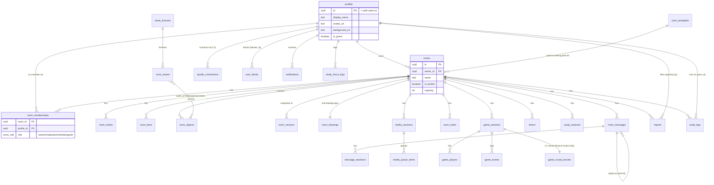

# DATABASE.md — Database Reference

- **Provider:** Supabase Postgres. Live project ref `jnercugeinepkgmbxdvn` (region `us-west-2`, project name "Yume" in the dashboard).
- **Schema source of truth:** `supabase/migrations/*.sql`, 21 files as of this audit, applied sequentially via `npx supabase db push`. **No local Postgres instance exists in the development environment this project was built in** (no Docker) — every migration has gone straight to the live project. There is no staging database.
- **Types:** `packages/supabase-types/src/database.ts`, **hand-maintained**, not generated (the `gen` script in that package's `package.json` requires `supabase gen types typescript --local`, which needs a local instance that has never existed here). **Known to have drifted**: `subscription_entitlements` is completely missing from it.
- **Seed data:** `supabase/seed.sql` — 7 decoration assets + 8 room templates. **Not applied automatically** by `db push`; was run once by hand against the live project via the Management API's raw SQL endpoint.

---

## Entity relationship diagram

Core relationships (2 of the 30 tables are standalone, no-FK-relationship tables and are omitted from the diagram for readability: `subscription_entitlements` and `rate_limit_counters` — see their own entries in the table reference below).

---

## Table reference

Grouped by feature area. **PK** = primary key, **FK** = foreign key. "Cascade" = `on delete cascade` (child rows deleted with parent); unmarked FKs default to Postgres's `no action` (delete blocked if referenced) unless noted.

### Identity & rooms

| Table | Key fields | Relationships | Notes |
|---|---|---|---|
| `profiles` | `id` PK (= `auth.users.id`), `display_name`, `avatar_url`, `custom_avatar` jsonb, `status` (`presence_status` enum), `is_guest`, `background_url` (added `0021`) | referenced by nearly every other table | The app-level user record. Created lazily on first use, not at signup time — see `DECISIONS.md` ADR-005/007. |
| `room_templates` | `id` PK, `name`, `is_system_template`, `objects` jsonb (array of pre-placed decoration specs) | `rooms.template_id` → this | 8 system templates seeded via `seed.sql`. |
| `rooms` | `id` PK, `owner_id` FK→profiles, `name`, `template_id` FK→room_templates, `is_locked`, `capacity` (default 12), `audio_mode` (`'spatial'`/`'room_wide'`) | | |
| `room_memberships` | `room_id` FK→rooms (cascade), `profile_id` FK→profiles (cascade), `role` (`room_role` enum), unique(`room_id`,`profile_id`) | | The per-room permission record. Owner's row is auto-created by the `handle_new_room()` trigger on room insert (`0003_room_creation.sql`) — see `DECISIONS.md` ADR-006 for the exact bug this trigger's timing caused. |
| `room_invites` | `id` PK, `room_id` FK→rooms (cascade), `token` unique, `password_hash`, `requires_owner_approval`, `max_uses`, `use_count`, `expires_at`, `revoked_at` | | No client SELECT policy at all — only `join-room` (service-role) can read invites; owner/moderator can manage (insert/update/delete) via RLS. |
| `room_bans` | `id` PK, `room_id` FK→rooms (cascade), `profile_id` FK→profiles (cascade, nullable), `banned_guest_fingerprint`, `banned_by` FK→profiles | | Written only by `moderate-participant` (service-role). Checked by `join-room` to block rejoin. |

### Room content

| Table | Key fields | Notes |
|---|---|---|
| `room_objects` | `id` PK, `room_id` FK→rooms (cascade), `type` (`room_object_type` enum), `asset_url`, `x`/`y`/`width`/`height`/`rotation`/`z_index`, `locked`, `owner_id` FK→profiles, `interaction_permissions` jsonb, `data` jsonb | Every placed decoration/sticky-note/text/embed. |
| `room_versions` | `id` PK, `room_id` FK→rooms (cascade), `snapshot` jsonb (full object-array snapshot) | Autosave (30s debounce) + manual restore via `restore_room_version` RPC. |
| `room_assets` | `id` PK, `name`, `category`, `asset_url`, `license_id` FK→asset_licenses, `is_active` | The decoration art library. Currently 7 placeholder SVGs, see `ASSET_LICENSES.md`. |
| `asset_licenses` | `id` PK, `source_url`, `creator`, `license`, `attribution_required` | |
| `room_drawings` | `room_id` PK (unique — one row per room), `strokes` jsonb array, `layer_locked` | Upserted with `on_conflict=room_id`. Strokes appended via `append_drawing_stroke` RPC, cleared via `clear_drawing_layer` RPC. |
| `room_notes` | `id` PK, `room_id` FK→rooms (cascade), `type` (`sticky`/`checklist`/`text`), `content` jsonb, `color`, `pinned`, `locked`, `edit_mode` (`'owner'`/`'everyone'`), `owner_id` FK→profiles | |

### Chat

| Table | Key fields | Notes |
|---|---|---|
| `room_messages` | `id` PK, `room_id` FK→rooms (cascade), `author_id` FK→profiles (nullable), `body`, `image_url`, `reply_to_id` FK→room_messages (self-ref), `mentions` uuid[], `deleted_at`/`deleted_by` (soft delete) | Rate-limited for guests via a trigger (`0016_moderation_rls.sql`). |
| `message_reactions` | `id` PK, `message_id` FK→room_messages (cascade), `profile_id` FK→profiles, `emoji` | |

### Media (YouTube/Spotify)

| Table | Key fields | Notes |
|---|---|---|
| `media_sessions` | `id` PK, `room_id` FK→rooms (cascade), `provider` (`media_provider` enum: `youtube`/`spotify`), `control_mode` (`'host_only'`/`'collaborative'`), `current_item_id`, `playback_state` (`'playing'`/`'paused'`), `position_ms`, `updated_by` FK→profiles | One row per room per provider (not enforced by a unique constraint on `(room_id, provider)` in the schema itself, but the application always upserts by that pair — see `0012_media_session_unique.sql` for what that migration actually added, worth double-checking if this ever seems to duplicate). |
| `media_queue_items` | `id` PK, `session_id` FK→media_sessions (cascade), `provider`, `external_id`, `title`, `thumbnail_url`, `duration_ms`, `added_by` FK→profiles, `position` | |
| `spotify_connections` | `id` PK, `profile_id` FK→profiles (cascade), `spotify_user_id`, `access_token`, `refresh_token`, `scope`, `expires_at`, `is_premium`, unique(`profile_id`) | OAuth tokens. RLS: own-row only, never readable by other users even in the same room. |

### Study mode / timers

| Table | Key fields | Notes |
|---|---|---|
| `study_sessions` | `id` PK, `room_id` FK→rooms (cascade), `work_minutes`, `break_minutes`, `status`, `started_at`, `ambient_audio_url`, `do_not_disturb` | |
| `study_focus_logs` | added `0010_study_focus_logs.sql` — not in `0001_init.sql`. **Exact columns not re-verified in this pass beyond confirming the table exists and has RLS** — check the migration file directly before relying on its shape. | Streak/session-duration stats. |
| `timers` | `id` PK, `room_id` FK→rooms (cascade), `type`, `mode` (`'shared'`/`'personal'`), `owner_id` FK→profiles, `duration_seconds`, `target_at`, `status`, `started_at`, `alarm_sound` | |

### Games

| Table | Key fields | Notes |
|---|---|---|
| `game_sessions` | `id` PK, `room_id` FK→rooms (cascade), `game_type` (`game_type` enum: `draw_and_guess`/`trivia`/`tic_tac_toe`/`connect_four` — note `connect_four` is a defined enum value with **no implementation anywhere**, see `FEATURES.md`), `status` (`'waiting'`/`'in_progress'`/`'finished'`), `state` jsonb, `created_by` FK→profiles | `state` shape is game-specific, defined by each engine in `packages/game-sdk`. |
| `game_players` | `id` PK, `session_id` FK→game_sessions (cascade), `profile_id` FK→profiles (cascade), `is_spectator`, `is_ready`, `score`, `connected`, unique(`session_id`,`profile_id`) | |
| `game_events` | `id` PK, `session_id` FK→game_sessions (cascade), `profile_id` FK→profiles (nullable), `event_type`, `payload` jsonb | Move log, written by the service-role dispatch. |
| `game_round_secrets` | `session_id` PK (unique, 1:1 with game_sessions), `secret` jsonb | Draw & Guess's secret word. RLS enabled, **zero client policies** — service-role only, by design (Postgres RLS can't hide one field from some readers of a row while showing it to others on that same row, so the secret can't live in `game_sessions.state`). |

### Moderation & safety

| Table | Key fields | Notes |
|---|---|---|
| `reports` | `id` PK, `room_id` FK→rooms (`on delete set null`), `reported_by` FK→profiles, `reported_profile_id` FK→profiles (nullable), `message_id` FK→room_messages (nullable), `reason`, `details`, `status` (`report_status` enum), `resolved_at`/`resolved_by` | Rate-limited via trigger. |
| `user_blocks` | `id` PK, `blocker_id` FK→profiles (cascade), `blocked_id` FK→profiles (cascade), unique(`blocker_id`,`blocked_id`) | Personal, not room-scoped. |
| `audit_logs` | `id` PK, `room_id` FK→rooms (`on delete set null`), `actor_id` FK→profiles (nullable), `action` text, `target_id` uuid (FK→profiles added in `0016`, was originally a bare uuid), `metadata` jsonb | No client insert policy at all — service-role only. |
| `rate_limit_counters` | `key` text PK, `window_start`, `count` | Added `0016_moderation_rls.sql`. RLS enabled, zero client policies. Backs the `check_rate_limit()` function. |

### Unused / inactive

| Table | Key fields | Notes |
|---|---|---|
| `notifications` | `id` PK, `profile_id` FK→profiles (cascade), `type`, `payload` jsonb, `read_at` | RLS enabled (own-row read/mark-read), **zero producers anywhere in the codebase** — nothing ever inserts a row. Would be the natural mechanism for the owner-approval-invite notification gap (`TASKS.md` `BUG-002`) if that's ever built. |
| `subscription_entitlements` | `id` PK, `profile_id` FK→profiles (cascade), `tier` (default `'free'`), `source`, `active` (default `false`), `current_period_end`, unique(`profile_id`) | **RLS is disabled** (verified live, `relrowsecurity = false`). **Zero application code references this table anywhere** (verified via full-repo grep). Not in `packages/supabase-types/src/database.ts`. See `SECURITY.md` `SEC-001` and `TASKS.md`. |

---

## Postgres RPC functions

| Function | Defined in | Purpose | Security |
|---|---|---|---|
| `room_role(p_room_id, p_profile_id)` | `0002_rls.sql` | Returns the caller's role in a room, or `null`. The building block nearly every RLS policy is written against. | `security definer` |
| `restore_room_version(p_room_id, p_version_id)` | `0007_restore_version_rpc.sql` | Atomically replaces all `room_objects` with a `room_versions` snapshot. | `security invoker` (relies on the caller's own RLS for the delete/insert it performs) |
| `append_drawing_stroke(p_room_id, p_stroke)` | `0008_drawing_functions.sql` | Appends one stroke to `room_drawings.strokes`. | — |
| `clear_drawing_layer(p_room_id)` | `0008_drawing_functions.sql` | Empties `room_drawings.strokes`. | — |
| `increment_game_score(p_session_id, p_profile_id, p_delta)` | `0015_game_extras.sql` | Atomic score increment (avoids a read-then-write race between two players scoring near-simultaneously). | `security invoker` |
| `check_rate_limit(p_key, p_limit, p_window_seconds)` | `0016_moderation_rls.sql` | Atomic sliding-window rate-limit check via `INSERT ... ON CONFLICT`. | `security definer` |
| `handle_new_room()` (trigger function, not directly callable) | `0003_room_creation.sql` | `AFTER INSERT ON rooms` — auto-creates the owner's `room_memberships` row. | `security definer` |
| `enforce_message_rate_limit()` / `enforce_invite_rate_limit()` / `enforce_report_rate_limit()` (trigger functions) | `0016_moderation_rls.sql` | `BEFORE INSERT` triggers calling `check_rate_limit()` for guests-messaging / invite-creation / report-submission. | `security definer` |

---

## Storage buckets

| Bucket | Public? | RLS pattern | Limits (`0017_upload_restrictions.sql`) |
|---|---|---|---|
| `avatars` | Yes | Own-folder-scoped writes (`(storage.foldername(name))[1] = auth.uid()`) | 5MB, png/jpeg/webp/gif |
| `room-assets` | Yes | Read-only for clients — inserts are service-role/seed-only | 10MB, png/jpeg/webp/gif/svg+xml |
| `uploads` | No (private) | Room-membership-scoped, signed URLs (1-year expiry) | 10MB, png/jpeg/webp/gif — **no SVG**, deliberately (an SVG can carry an embedded `<script>`) |
| `user-backgrounds` | Yes | Own-folder-scoped writes (same pattern as `avatars`) | 8MB, png/jpeg/webp |

No malware/content scanning exists on any bucket — file-type/size limits are Supabase Storage's own server-side enforcement, not a substitute for content scanning. Documented as a deliberate, honest gap (no scanning API is configured in this environment).

---

## Known schema risks

1. **`subscription_entitlements` has RLS disabled** — live, unfixed, low-current-impact security gap. See `SECURITY.md` `SEC-001`.
2. **`packages/supabase-types/src/database.ts` is hand-maintained and already known to have drifted** (missing `subscription_entitlements` entirely). No automated check catches this class of drift.
3. **No local database** — every migration is applied directly to the only Postgres instance that exists (production). No tested rollback procedure exists for a bad migration beyond writing a new corrective migration.
4. **`game_type` enum includes `connect_four` with zero implementation** — this is a leftover from original planning (`docs/phase-1/01-prd.md` lists Tic-Tac-Toe *or* Connect Four as the launch option; Tic-Tac-Toe was chosen) rather than a bug, but worth knowing the enum value exists and does nothing if it's ever selected somewhere.
5. **`audit_logs.target_id`** was originally a bare `uuid` with no foreign key at all; a FK to `profiles(id)` was added later (`0016_moderation_rls.sql`) specifically so the moderation-log UI could embed a display name. If `target_id` is ever used to reference something other than a profile, this FK will need reconsidering.
