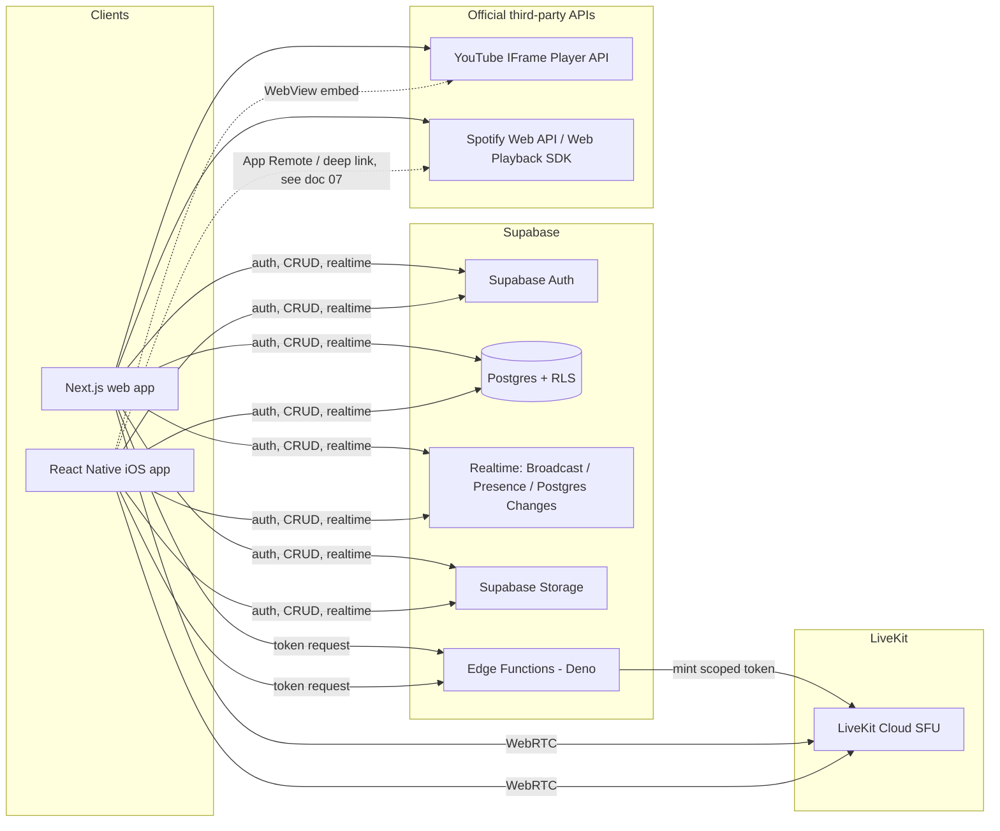

# 02 — System Architecture

## 1. High-level diagram

## 2. Why this split

- **Supabase is the system of record** for everything that must survive a
  refresh: accounts, room structure, decoration objects, chat, notes,
  invites, permissions, moderation state. Postgres + RLS gives us
  per-row authorization without a bespoke authZ service.
- **LiveKit is the system of record for nothing** — it is a transport for
  live audio/video/screen-share tracks and short-lived participant metadata
  (mute state, speaking level). We do not build our own SFU/WebRTC stack
  (explicit instruction), and we do not lean on it for durable state either,
  so it can be swapped for self-hosted LiveKit later without touching the
  data model.
- **Supabase Realtime (Broadcast + Presence)** is the channel for
  *ephemeral, high-frequency* room interaction: bubble drag positions,
  drawing-layer cursor strokes, emoji reactions, game move events, "who's in
  the room right now." This is deliberately decoupled from the LiveKit
  connection — a participant can be in a room (seeing decoration, chat,
  drawing) without ever opening a mic/camera track, and vice versa.
- **Postgres Changes** (Realtime) is used for lower-frequency, must-be-
  consistent state: chat messages, object creation/deletion, permission
  changes, invite revocation.
- **Edge Functions** hold anything that needs a secret or server-side
  authority check: minting LiveKit tokens, hashing/verifying room
  passwords, issuing guest sessions bound to a specific invite, refreshing
  Spotify OAuth tokens, generating signed Storage upload URLs, and running
  moderation actions (kick/ban) that must be authoritative rather than
  client-trusted.

## 3. Room object model (shared across web + iOS)

One normalized shape, defined once in `packages/room-schema` (TypeScript +
Zod, mirrored by the `room_objects` table — see
[03-data-model.md](03-data-model.md)), consumed by two renderers:

- **Web:** React Konva (Canvas 2D scene graph — good fit for shadcn/ui-based
  editing chrome around it).
- **iOS:** React Native Skia (GPU-backed, same declarative-shape mental
  model as Konva, good performance for drag/animation on-device).

Every `RoomObject` carries: `id`, `room_id`, `type` (furniture | rug | plant
| lamp | poster | frame | window | background | gif | sticker | image |
text | sticky_note | embed | drawing_stroke | decorative), `asset_url`,
`x, y, width, height, rotation`, `z_index`, `locked`, `owner_id`,
`interaction_permissions` (jsonb — who besides owner can move/edit/delete),
`created_at`, `updated_at`. Both renderers read this shape and know nothing
about Postgres directly — they go through a shared `packages/room-schema`
client that wraps Supabase calls, so renderer code stays platform-specific
but data access code does not.

Rendering differences (documented fully in
[06-feature-parity-matrix.md](06-feature-parity-matrix.md)) are isolated to
`apps/web/*` and `apps/mobile/*`; the object model, validation, and sync
logic are shared.

## 4. Synchronization model — two tiers

**Tier 1 — ephemeral (never hits Postgres directly):**
Bubble position while dragging, live cursor position while drawing, in-
progress stroke points, typing indicators, emoji reaction bursts, game
board moves during a turn. Sent over a Supabase Realtime **Broadcast**
channel scoped per room (`room:{roomId}:live`), fanned out to all
subscribers, at a client-side throttle (~15–20 Hz for drag, higher for
drawing strokes batched into small point arrays). Nothing here is
persisted as it happens.

**Tier 2 — persisted (hits Postgres, then fans out via Postgres Changes):**
Final object position after a drag ends, object create/delete/resize/lock,
chat messages, notes, invite/permission changes, completed drawing strokes
(saved as vector data once the stroke is finished, not per-point), game
results. Writes go through RLS-guarded `insert`/`update`/`upsert` calls (or
an Edge Function/RPC when the mutation needs a server-side authority check,
e.g. "only owner or moderator can delete another user's object"). See full
protocol in [05-sync-protocol.md](05-sync-protocol.md).

This two-tier split is what satisfies the explicit performance requirement:
**do not send every drag movement to Postgres** — only tier 1 sees the raw
movement stream, and only the final resting state is persisted.

## 5. Conflict resolution

- Each persisted row has `updated_at` and `updated_by`. Writes are
  last-write-wins at the row level, gated by RLS (a write is only accepted
  if the actor has permission on that object *right now*, not just when the
  drag started).
- Two users dragging the same unlocked object concurrently is resolved by:
  last Tier-1 broadcast wins visually during the drag (everyone sees the
  same live position because they all subscribe to the same broadcast
  stream), and the final Tier-2 write is whichever drag-end event reaches
  Postgres last — acceptable for a 2–12 person cozy-room product, not a
  CRDT-grade requirement.
- `room_versions` stores periodic full-room snapshots (see data model) so a
  bad concurrent edit is always recoverable via "restore previous version,"
  which is the actual safety net rather than trying to build operational
  transforms for furniture placement.

## 6. Presence & reconnection

- Supabase Realtime **Presence** tracks who is subscribed to a room
  (online/away/busy/studying/offline, derived partly from explicit status
  and partly from tab/app foreground state), heartbeating automatically via
  the client SDK's presence protocol.
- LiveKit connection state is tracked separately (a participant can be
  "present" in the room without an active LiveKit session). Camera-bubble
  UI shows profile picture until a LiveKit video track subscription exists
  for that participant.
- On network drop: Realtime channel and LiveKit room both attempt
  reconnect with exponential backoff; on reconnect, the client re-fetches
  current object state (a cheap "resync" query) rather than trusting any
  buffered Tier-1 events it may have missed, since Tier 1 is explicitly
  non-authoritative.

## 7. Portability to self-hosted LiveKit

Nothing in the data model or Edge Functions is LiveKit-Cloud-specific
beyond the project URL/API key/secret used to mint tokens
(`livekit-server-sdk` in an Edge Function). Moving to self-hosted LiveKit
later is a config change (host URL + keys) plus infra ops, not an
application rewrite.

## 8. Mobile native-module strategy

Start with **Expo prebuild + a custom dev client** (not Expo Go — Expo Go
cannot load custom native modules). Add config plugins for:
- `@livekit/react-native` (has an official Expo config plugin)
- ReplayKit broadcast extension (for full-screen screen share — requires a
  native broadcast upload extension target, doable via a config plugin or a
  thin native module if no plugin covers it)
- Vision/Core Image-based camera effects (native module, likely needs a
  custom Expo module or a small bare native module even inside a prebuild
  workflow — prebuild still allows arbitrary native code, it just means we
  own the `ios/` folder as generated output rather than hand-maintained)

If any single piece genuinely cannot work inside Expo's prebuild model,
eject that feature to a fully bare RN setup rather than the whole app —
Expo prebuild output *is* a normal Xcode project, so this is a gradual
escape hatch, not a rewrite. This satisfies the brief's instruction to
"use bare React Native if required," scoped to only the pieces that need
it.

## 9. Monorepo shape

See [10-folder-structure.md](10-folder-structure.md) for the full tree.
Summary: Turborepo + pnpm workspaces, `apps/web` (Next.js) and
`apps/mobile` (RN), shared `packages/*` for the room schema, generated
Supabase types, game SDK interfaces, and lint/TS config presets.
